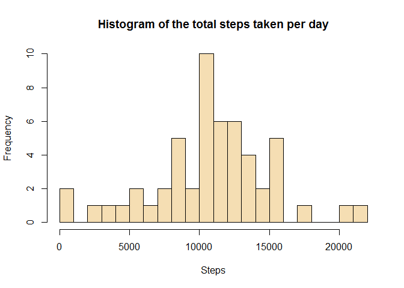
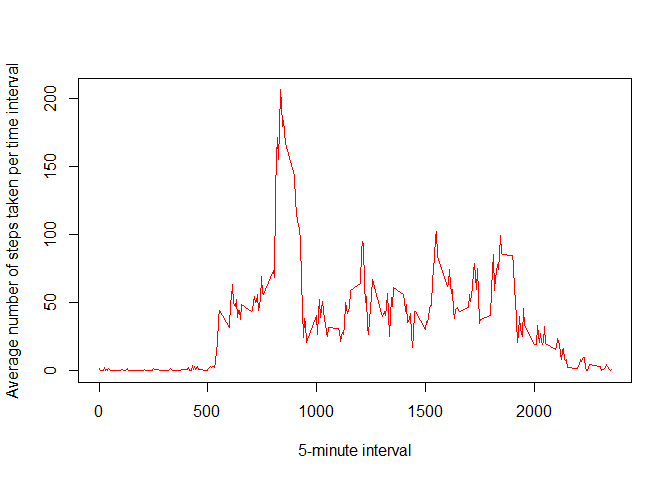
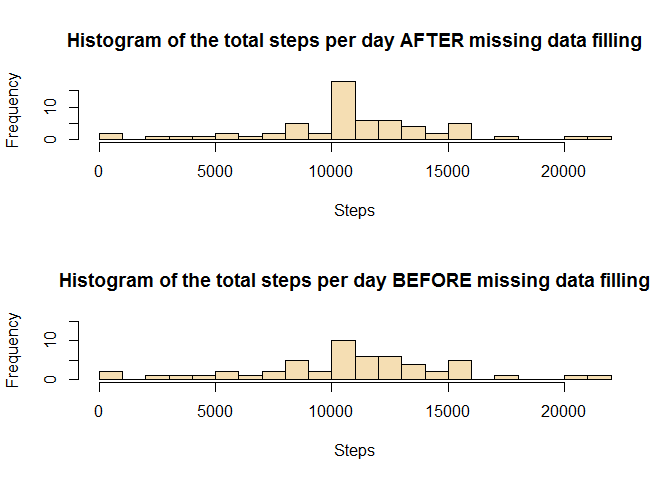

## Loading and preprocessing the data
1. Load the data (i.e. \color{red}{\verb|read.csv()|}read.csv())

```r
unzip("activity.zip",exdir = "data")
activity <- read.csv("data/activity.csv", stringsAsFactors=FALSE)
str(activity)
```

```
## 'data.frame':	17568 obs. of  3 variables:
##  $ steps   : int  NA NA NA NA NA NA NA NA NA NA ...
##  $ date    : chr  "2012-10-01" "2012-10-01" "2012-10-01" "2012-10-01" ...
##  $ interval: int  0 5 10 15 20 25 30 35 40 45 ...
```

```r
summary(activity)
```

```
##      steps            date              interval     
##  Min.   :  0.00   Length:17568       Min.   :   0.0  
##  1st Qu.:  0.00   Class :character   1st Qu.: 588.8  
##  Median :  0.00   Mode  :character   Median :1177.5  
##  Mean   : 37.38                      Mean   :1177.5  
##  3rd Qu.: 12.00                      3rd Qu.:1766.2  
##  Max.   :806.00                      Max.   :2355.0  
##  NA's   :2304
```

2. Process/transform the data (if necessary) into a format suitable for your analysis

```r
options(warn = -1)
library(dplyr,quietly = TRUE)
```

```
## 
## Attaching package: 'dplyr'
```

```
## The following objects are masked from 'package:stats':
## 
##     filter, lag
```

```
## The following objects are masked from 'package:base':
## 
##     intersect, setdiff, setequal, union
```

```r
activity <- mutate(activity, date = as.Date(as.character(date), "%Y-%m-%d"))
```

## What is mean total number of steps taken per day?
1. Calculate the total number of steps taken per day


```r
steps_per_day <- aggregate(steps ~ date, data = activity, sum, na.rm = TRUE)
head(steps_per_day)
```

```
##         date steps
## 1 2012-10-02   126
## 2 2012-10-03 11352
## 3 2012-10-04 12116
## 4 2012-10-05 13294
## 5 2012-10-06 15420
## 6 2012-10-07 11015
```

2. Make a histogram of the total number of steps taken each day

```r
hist(steps_per_day$steps, main = "Histogram of the total steps taken per day", xlab = "Steps", breaks = 16, col = "wheat")
```

<!-- -->

3. Calculate and report the mean and median of the total number of steps taken per day


```r
meanSteps <- mean(steps_per_day$steps, na.rm = TRUE)
medianSteps <- median(steps_per_day$steps, na.rm = TRUE)
```

The mean total number of steps taken per day is 10766  
The median total number of steps taken per day is 10765


## What is the average daily activity pattern?
1. Make a time series plot (i.e. type="l") of the 5-minute interval (x-axis) and the average number of steps taken, averaged across all days (y-axis)

```r
interval_steps <- group_by(activity, interval) %>%
    summarise(mean = mean(steps, na.rm = TRUE))
with(interval_steps, 
     plot(interval, mean, 
          type = "l", 
          col = "red", 
          xlab = "5-minute interval",
          ylab = "Average number of steps taken per time interval"))
```

<!-- -->
2. Which 5-minute interval, on average across all the days in the dataset, contains the maximum number of steps?

```r
max_steps_interval <- interval_steps$interval[which.max(interval_steps$mean)]
max_steps_interval
```

```
## [1] 835
```

## Imputing missing values

1. Calculate and report the total number of missing values in the dataset (i.e. the total number of rows with  NA)

```r
na_number <- sum(is.na(activity$steps))
percentage_na <- mean(is.na(activity$steps)) * 100
```
The total number of missing values is 2304  
The total percentage of missing values is 13.1147541 %

2. Devise a strategy for filling in all of the missing values in the dataset. The strategy does not need to be sophisticated. For example, you could use the mean/median for that day, or the mean for that 5-minute interval, etc.

Here is my strategy. Given a NA step value, first try to fill it with the median of that day. If this median result is also NA, we then try to fill it with the mean for that 5-minute interval. In the end, I check the NA values of the new data, which is zero.

3. Create a new dataset that is equal to the original dataset but with the missing data filled in.


```r
mean_median_steps_per_day <- group_by(activity, date) %>%
    summarise(mean = mean(steps, na.rm = TRUE),
              median = median(steps, na.rm = TRUE)) #median of the total number of steps taken

activity_copy <- activity  # for a protection of the original data
#rm(activity)  # release the memory
l <- nrow(activity_copy)
for (i in 1:l) {
    if (is.na(activity_copy$steps[i])) {
        today = activity_copy$date[i]
        sub_value = mean_median_steps_per_day[mean_median_steps_per_day$date == today, "median"]
        if (!is.na(sub_value)) {
            activity_copy$steps[i] = sub_value
        } else {
            pattern = activity_copy$interval[i]
            sub_value = interval_steps[interval_steps$interval == pattern, "mean"]
            activity_copy$steps[i] = sub_value
        }
    }
}

sum(is.na(activity_copy$steps))
```

```
## [1] 0
```

```r
#str(activity_copy)
# The result shows that the format of the column steps is list. We first convert it to numeric.
activity_copy <- mutate(activity_copy, steps = as.numeric(steps))
write.csv(activity_copy, file = "activity_copy.csv") # save the new data
sum_mean_median_day <- group_by(activity_copy, date) %>%
    summarise(sum_steps = sum(steps),
              mean_steps = mean(steps),
              median_steps = median(steps))
sum_mean_median_day
```

```
## # A tibble: 61 x 4
##    date       sum_steps mean_steps median_steps
##    <date>         <dbl>      <dbl>        <dbl>
##  1 2012-10-01    10766.     37.4           34.1
##  2 2012-10-02      126       0.438          0  
##  3 2012-10-03    11352      39.4            0  
##  4 2012-10-04    12116      42.1            0  
##  5 2012-10-05    13294      46.2            0  
##  6 2012-10-06    15420      53.5            0  
##  7 2012-10-07    11015      38.2            0  
##  8 2012-10-08    10766.     37.4           34.1
##  9 2012-10-09    12811      44.5            0  
## 10 2012-10-10     9900      34.4            0  
## # ... with 51 more rows
```

```r
str(sum_mean_median_day)
```

```
## Classes 'tbl_df', 'tbl' and 'data.frame':	61 obs. of  4 variables:
##  $ date        : Date, format: "2012-10-01" "2012-10-02" ...
##  $ sum_steps   : num  10766 126 11352 12116 13294 ...
##  $ mean_steps  : num  37.383 0.438 39.417 42.069 46.16 ...
##  $ median_steps: num  34.1 0 0 0 0 ...
```

4. Make a histogram of the total number of steps taken each day and Calculate and report the mean and median total number of steps taken per day. Do these values differ from the estimates from the first part of the assignment? What is the impact of imputing missing data on the estimates of the total daily number of steps?


```r
par(mfcol = c(2,1))
hist(sum_mean_median_day$sum_steps, main = "Histogram of the total steps per day AFTER missing data filling", xlab = "Steps", breaks = 16, col = "wheat")
hist(steps_per_day$steps, main = "Histogram of the total steps per day BEFORE missing data filling", xlab = "Steps", breaks = 16, col = "wheat", ylim = c(0,15))
```

<!-- -->


## Are there differences in activity patterns between weekdays and weekends?

1. Create a new factor variable in the dataset with two levels - "weekday" and "weekend" indicating whether a given date is a weekday or weekend day.


```r
state <- ifelse(weekdays(activity_copy$date) %in% c("Saturday", "Sunday"), "weekend", "weekday")
state <- as.factor(state)
activity_copy$state <- state
str(activity_copy)
```

```
## 'data.frame':	17568 obs. of  4 variables:
##  $ steps   : num  1.717 0.3396 0.1321 0.1509 0.0755 ...
##  $ date    : Date, format: "2012-10-01" "2012-10-01" ...
##  $ interval: int  0 5 10 15 20 25 30 35 40 45 ...
##  $ state   : Factor w/ 2 levels "weekday","weekend": 1 1 1 1 1 1 1 1 1 1 ...
```


2. Make a panel plot containing a time series plot (i.e. type="l") of the 5-minute interval (x-axis) and the average number of steps taken, averaged across all weekday days or weekend days (y-axis). See the README file in the GitHub repository to see an example of what this plot should look like using simulated data.

```r
average_steps_state <- group_by(activity_copy, state, interval) %>%
    summarise(average_steps = mean(steps))
str(average_steps_state)
```

```
## Classes 'grouped_df', 'tbl_df', 'tbl' and 'data.frame':	576 obs. of  3 variables:
##  $ state        : Factor w/ 2 levels "weekday","weekend": 1 1 1 1 1 1 1 1 1 1 ...
##  $ interval     : int  0 5 10 15 20 25 30 35 40 45 ...
##  $ average_steps: num  2.251 0.445 0.173 0.198 0.099 ...
##  - attr(*, "vars")= chr "state"
##  - attr(*, "drop")= logi TRUE
```

```r
library(lattice)
xyplot(average_steps ~ interval | state, data = average_steps_state, type = "l", layout = c(1,2), xlab = "Interval", ylab = "Number of steps")
```

<!-- -->


